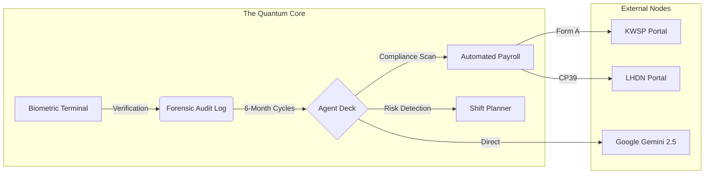

# PUNCH⏰CLOCK Malaysia v2.5 🇲🇾
### The "Quantum" HR Operating System for Enterprise SMEs.

---

## ⚡ Next-Gen Architecture
PUNCH⏰CLOCK is no longer just a punch card app. It is a full-lifecycle **Workforce Intelligence Core**. 

### 🧬 Data Connections Visualized

---

## 🚀 Key Feature Integrations

### 👁️ Biometric Integrity 2.0
*   **Zero-Error Recognition**: Client-side inference via `face-api.js` (SSD Mobilenet v1).
*   **Anti-Spoofing Protocol**: Multi-vector liveness challenges (Smile, Blink) + GPS Geofencing (100m Office Radius).
*   **Secure PIN Fallback**: AES-like local hashing for secure secondary authentication.

### 🤖 The Agentic Sidebar
*   **Expert Consultant**: A collapsible AI command deck that acts as your 24/7 Senior HR Consultant.
*   **Forensic Scenarios**: One-click deep-dives into 180-day behavioral trends, OT volatility, and "Flight Risk" detection.
*   **Pro Report Engine**: Export expert analysis into professional, Malaysian-legal-standard PDF reports instantly.

### 💸 Statutory Auto-Pilot
*   **LHDN 2025 Ready**: Progressive tax logic (MTD) mapped to latest Malaysian tax tiers.
*   **Statutory Ceilings**: Automated capping for EPF (RM20k ceiling) and SOCSO (RM5k ceiling).
*   **Claim-to-Payslip**: Seamless integration where approved expense claims auto-populate as allowances.

### 🗓️ AI Workforce Optimizer
*   **Constraint Satisfaction**: AI auto-rostering that respects approved leaves, role distributions, and EA 1955 weekly hour limits.
*   **SOS Handler**: Real-time replacement suggestions for no-shows based on OT cost and skill match.

---

## 📈 Enterprise Efficiency Metrics

| Process | Manual Spreadsheet | PUNCHCLOCK AI | Saving |
| :--- | :--- | :--- | :--- |
| **Attendance Audit** | 4 Hours / Day | Instant (Real-time) | 100% |
| **Payroll Generation** | 3 Days / Month | 3 Clicks (< 2 Mins) | 99% |
| **Legal Drafting** | 2 Hours / Doc | AI Drafted (30 Secs) | 95% |
| **Roster Planning** | 6 Hours / Week | AI Generated (1 Min) | 98% |

---

## 👨‍💻 Developed By
**Crafted with tactile authority by w3jdev**
*   🌐 [w3jdev.com](https://w3jdev.com)
*   🐙 [github.com/w3jdev](https://github.com/w3jdev)
*   💼 [linkedin.com/in/w3jdev](https://linkedin.com/in/w3jdev)

---
*Disclaimer: System calculations are based on the Malaysian Employment Act 1955 as of Jan 2025.*
