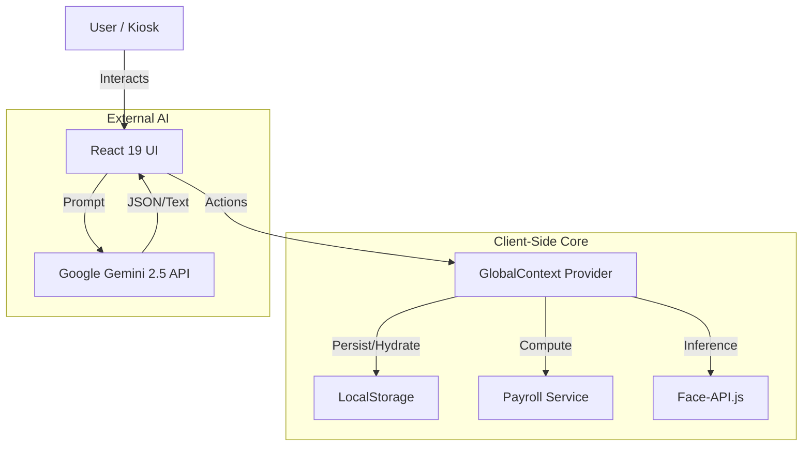

# System Architecture

## 1. High-Level Diagram

## 2. The "Sticky State" Pattern
Since this is a serverless PWA for the current version, we treat `localStorage` as our database.

*   **Hook**: `useStickyState<T>(key, default)`
*   **Behavior**:
    1.  On Mount: Read from `localStorage`. If empty, use default (or demo data).
    2.  On Update: `useEffect` writes state changes back to `localStorage`.
*   **Limitations**: Storage limit (~5MB). Not suitable for images/video (we compress avatars/docs to Base64 or use references).

## 3. Module Boundaries

### A. Authentication
*   **Current**: Simulation. Role-based login (Admin/HR/Manager/Staff) sets a `currentUser` object in state.
*   **Future**: JWT/Supabase Auth.

### B. Biometrics
*   **Model Loading**: Models loaded from CDN (`justadudewhohacks.github.io`) on app mount to `window.faceapi`.
*   **Processing**: Video stream frames are processed on a canvas. Descriptors (Float32Array) are serialized to Arrays for storage JSON.

### C. PDF Generation
*   Uses `jsPDF` completely client-side.
*   Constructs vector graphics for text and layout to ensure print quality.
*   Injects Base64 images for logos.
